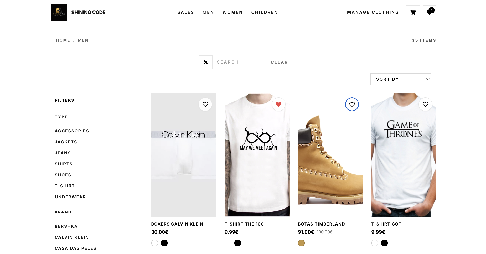
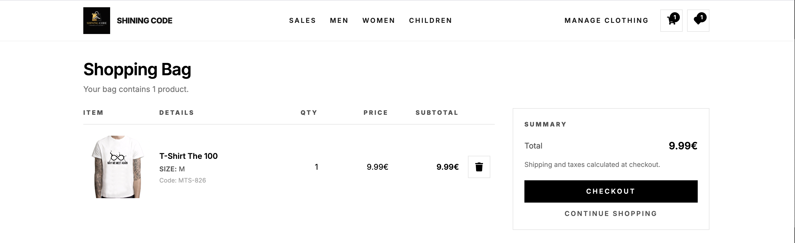

# 🛍️ Shining Code — Fashion E-Commerce Web App

Shining Code is a full-stack clothing store web app inspired by clean, minimal fashion websites.
Users can browse products by category, search and filter items, add favorites to a wishlist, and manage a shopping cart.
An admin area is included for managing products, pricing, discounts, and product images.

## Preview

## 🧰 Tech Stack
### Frontend
	- React
	- React Hooks (useState, useEffect, useContext, createContext)
	- React Router
	- Tailwind CSS
	- Filepond (File Upload handler)
	- Hex-to-color (Get color name from hex-code)
	- Axios (Request handler)
	- React-color (Color picker)
    - Notistack
### Backend
	- NodeJs
	- Express (routes)
	- MongoDB
	- Mongoose (DB access)
	- Filereader 
	- Multer (files request handler)
	- Path (Multer support)
	- BinData (store files smaller than 16MB in database - alternative to GridFS)
